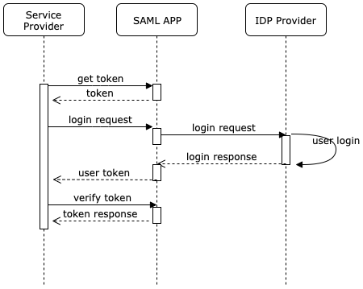
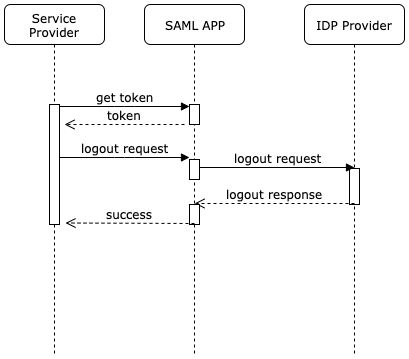

## App Login/Logout Flows

#### Login Flow


##### Step 1:
* Get a token via the api. This token will be used for authentication.
* For this use admin email and access token for basic auth.

```
POST /api/get-token
```
##### Step 2:
* Send this token to login.

```
GET /saml/<group_name>/login?token=<token_value>
```
##### Step 3:
* On successful login SAML App will send a token on success_callback URL.
* use this token to verify request.
```
POST /api/verify-token    #with body token = <token_received_by_saml_app>
```


#### Logout Flow


##### Step 1:
* Get a token via the api. This token will be used for authentication.
* For this use admin email and access token for basic auth.
```
POST /api/get-token
```
##### Step 2:
* Send this token to login.
```
GET /saml/<group_name>/logout?token=<token_value>
```
##### Step 3:
* On successful logout SAML App will send a null valued token on success_callback URL.

