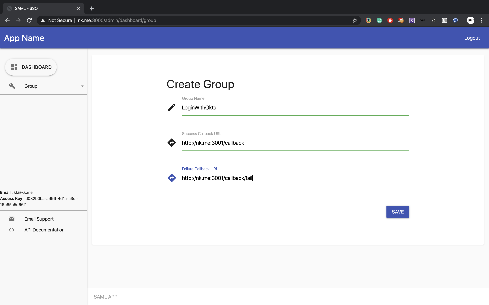
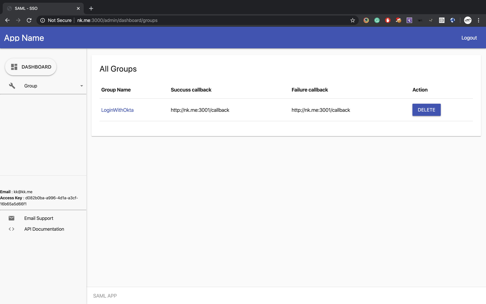
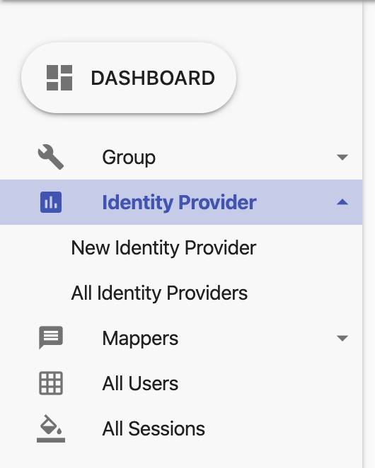
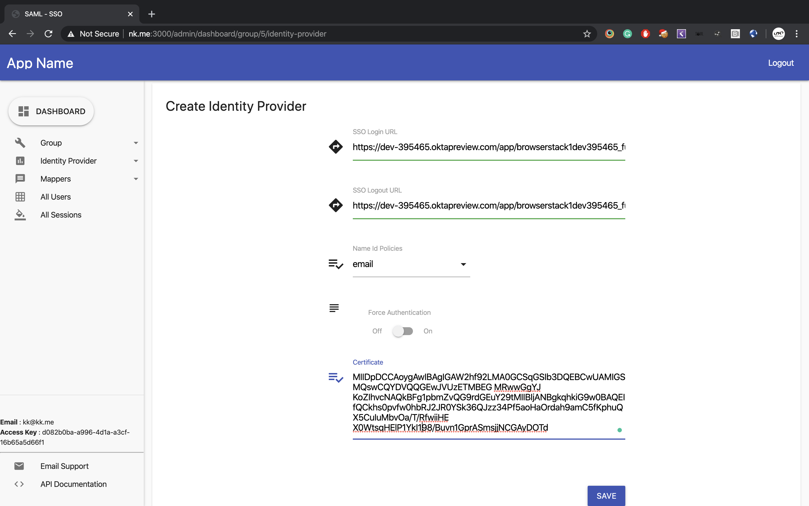
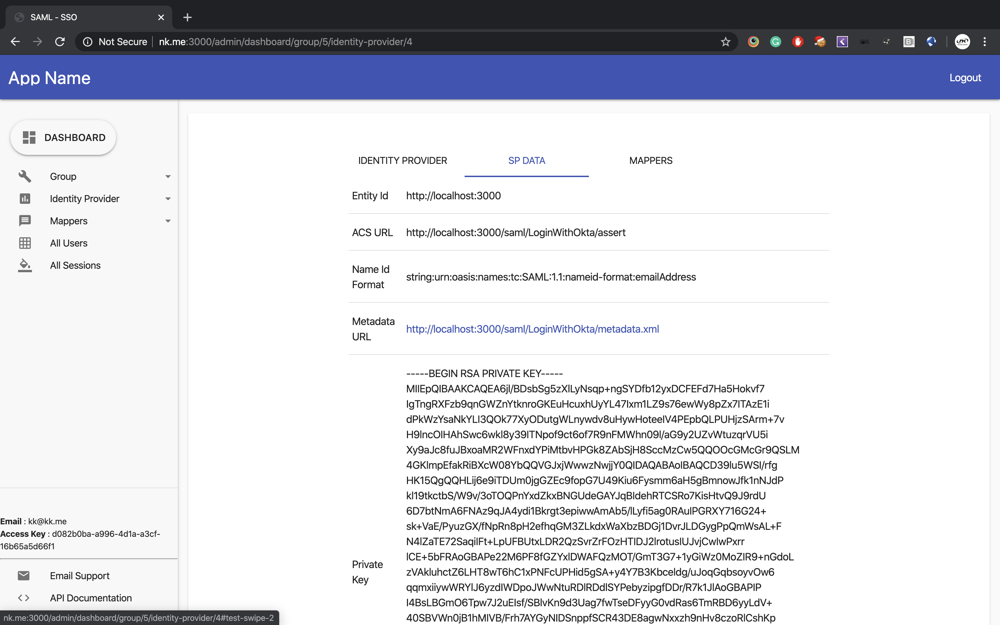
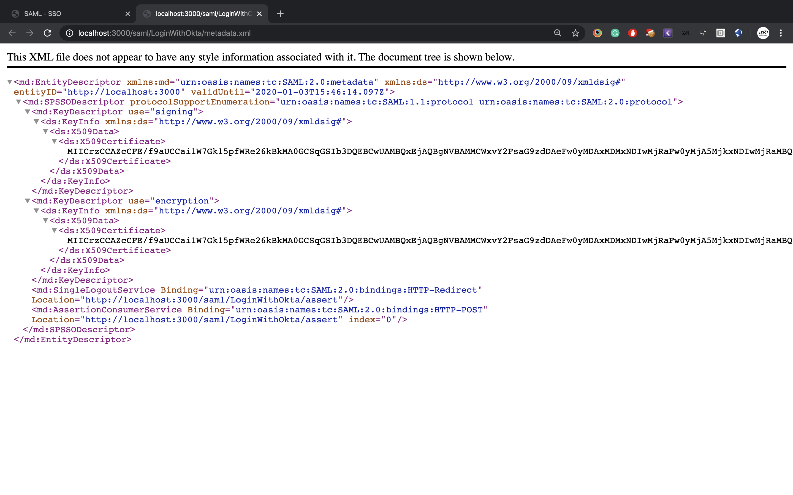
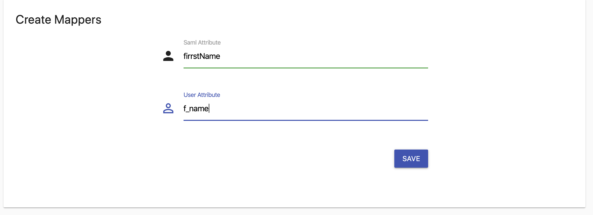

## Login/Logout with OKTA
### Admin panel login URl 
<host_name>/admin/login

##### Step 1:
* Create a group for your customer
* Provide group name, success callback anf failure callback.

##### Step 2:
* Click on the group name.

##### Step 3:
* On sidebar click on Identity Provider and then click on New Identity Provider.

##### Step 4:
* Fill all details provided by the IDP metadata.

##### Step 5:
* Use Metadata URL for SP metadata.

##### Step 6:
* Share this metadata with the IDP Provider.

##### Step 7:
* Create Mappers for the use saml attribute. 

